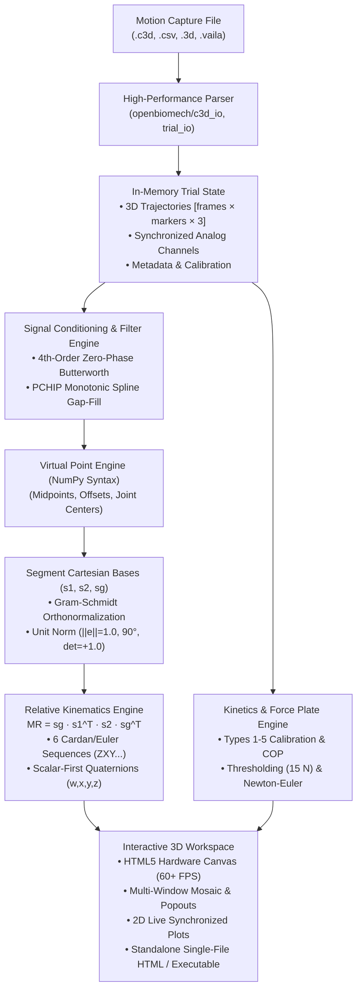

# mkvis3d / OpenBiomech — Complete User Manual & Biomechanics Guide

> **An Open-Source, Reproducible Motion Viewer and Biomechanical Analysis Suite**  
> *Author:* OpenBiomech Project & Contributors  
> *Theoretical Foundations:* Formulated according to International Society of Biomechanics (ISB) recommendations, Winter's *Biomechanics and Motor Control of Human Movement*, and classical 3D motion analysis mathematical frameworks.

---

## Table of Contents

- [1. Overview & Architecture](#1-overview--architecture)
  - [1.1 What is mkvis3d?](#11-what-is-mkvis3d)
  - [1.2 Supported Data Formats](#12-supported-data-formats)
  - [1.3 System Architecture & Principles](#13-system-architecture--principles)
  - [1.4 Quick Start Guide (30 Seconds)](#14-quick-start-guide-30-seconds)
- [2. Biomechanical Coordinate Systems & Orthonormal Bases](#2-biomechanical-coordinate-systems--orthonormal-bases)
  - [2.1 Global Reference System (sg — Laboratory World)](#21-global-reference-system-sg--laboratory-world)
  - [2.2 Local Segment Coordinate Systems (s1, s2 — Anatomical Frames)](#22-local-segment-coordinate-systems-s1-s2--anatomical-frames)
  - [2.3 3-Point Basis Construction](#23-3-point-basis-construction)
  - [2.4 Strict Gram-Schmidt Orthonormalization](#24-strict-gram-schmidt-orthonormalization)
  - [2.5 Mathematical Verification & Right-Handed Rule](#25-mathematical-verification--right-handed-rule)
- [3. Relative Joint Kinematics (MR, Cardan/Euler & Quaternions)](#3-relative-joint-kinematics-mr-cardaneuler--quaternions)
  - [3.1 The Relative Orientation Matrix (MR)](#31-the-relative-orientation-matrix-mr)
  - [3.2 Cardan / Euler Angle Extraction](#32-cardan--euler-angle-extraction)
  - [3.3 Tait-Bryan Sequences & Clinical Meaning](#33-tait-bryan-sequences--clinical-meaning)
  - [3.4 Gimbal Lock Singularities & Precautions](#34-gimbal-lock-singularities--precautions)
  - [3.5 Unit Quaternions (Scalar-First Convention)](#35-unit-quaternions-scalar-first-convention)
- [4. Virtual Points & Secondary Landmark Creator](#4-virtual-points--secondary-landmark-creator)
  - [4.1 Why Virtual Points Matter in Biomechanics](#41-why-virtual-points-matter-in-biomechanics)
  - [4.2 NumPy Vector Expression Syntax](#42-numpy-vector-expression-syntax)
  - [4.3 Common Formula Templates](#43-common-formula-templates)
  - [4.4 Reusable Pipelines & Script Generation](#44-reusable-pipelines--script-generation)
- [5. Signal Conditioning: Filtering & Gap Interpolation](#5-signal-conditioning-filtering--gap-interpolation)
  - [5.1 Butterworth Dual-Pass Digital Filter](#51-butterworth-dual-pass-digital-filter)
  - [5.2 Visual3D-Grade Trajectory Gap Inspection](#52-visual3d-grade-trajectory-gap-inspection)
  - [5.3 1-Click Gap Interpolation (PCHIP, Linear, Nearest)](#53-1-click-gap-interpolation-pchip-linear-nearest)
  - [5.4 Multi-Curve Toggles & Dynamic Scaling](#54-multi-curve-toggles--dynamic-scaling)
- [6. Anthropometry & Whole-Body Center of Mass (de Leva 1996)](#6-anthropometry--whole-body-center-of-mass-de-leva-1996)
  - [6.1 The 16-Segment Human Body Model](#61-the-16-segment-human-body-model)
  - [6.2 Sex-Specific Mass & CoM Coefficients](#62-sex-specific-mass--com-coefficients)
  - [6.3 Whole-Body Center of Mass Equation](#63-whole-body-center-of-mass-equation)
- [7. Force Platforms, Ground Reaction Forces & Kinetics](#7-force-platforms-ground-reaction-forces--kinetics)
  - [7.1 Force Plate Types (1 to 5) & Calibration](#71-force-plate-types-1-to-5--calibration)
  - [7.2 Center of Pressure (COP) Mechanics](#72-center-of-pressure-cop-mechanics)
  - [7.3 Non-Contact Singularities & Thresholding](#73-non-contact-singularities--thresholding)
  - [7.4 Recursive 3D Newton-Euler Inverse Dynamics](#74-recursive-3d-newton-euler-inverse-dynamics)
- [8. Workspace Visualization & Multi-Window Navigation](#8-workspace-visualization--multi-window-navigation)
  - [8.1 3D Camera Controls & Navigation](#81-3d-camera-controls--navigation)
  - [8.2 Fast 3D Viewport Refresh](#82-fast-3d-viewport-refresh)
  - [8.3 Mosaic Layouts, Splitters & Multi-Monitor Popouts](#83-mosaic-layouts-splitters--multi-monitor-popouts)
  - [8.4 Synchronized Reference Video](#84-synchronized-reference-video)
  - [8.5 Custom Marker Appearance (viewc3d Parity)](#85-custom-marker-appearance-viewc3d-parity)
- [9. Data Export, Pipelines & CLI Automation](#9-data-export-pipelines--cli-automation)
  - [9.1 Standalone Offline HTML Export](#91-standalone-offline-html-export)
  - [9.2 C3D Export with Analog Signal Preservation](#92-c3d-export-with-analog-signal-preservation)
  - [9.3 Blender 3D Python Integration](#93-blender-3d-python-integration)
  - [9.4 Complete Open .vaila Project Archives](#94-complete-open-vaila-project-archives)
  - [9.5 Command-Line Interface (CLI) Reference](#95-command-line-interface-cli-reference)
- [10. Practical Step-by-Step Tutorials](#10-practical-step-by-step-tutorials)
  - [10.1 Tutorial A: Hip Joint Kinematics during Gait](#101-tutorial-a-hip-joint-kinematics-during-gait)
  - [10.2 Tutorial B: Deep Squat Knee Kinematics & GRF Symmetry](#102-tutorial-b-deep-squat-knee-kinematics--grf-symmetry)
  - [10.3 Tutorial C: Countermovement Jump (CMJ) Impulse & CoM](#103-tutorial-c-countermovement-jump-cmj-impulse--com)
- [11. Biomechanical Standards & Literature Cross-Reference](#11-biomechanical-standards--literature-cross-reference)
- [12. Keyboard & Mouse Shortcuts](#12-keyboard--mouse-shortcuts)

---

## 1. Overview & Architecture

### 1.1 What is mkvis3d?
**mkvis3d** (module `openbiomech`) is an open-source, reproducible, high-performance motion capture viewer and computational biomechanics engine. It provides researchers, clinicians, and sports biomechanists with the capabilities of commercial suites like **C-Motion Visual3D** and **BTK Mokka**, but with modern web technologies, zero-install standalone portability, and full mathematical transparency.

Key design pillars:
1. **Mathematical Rigor:** Strict ISB standards, Gram-Schmidt orthonormalization ($\|e\|=1.0, 90^\circ, \det=+1.0$), scalar-first quaternions, and verified inverse dynamics equations.
2. **Offline-First & Zero Dependencies:** Operates completely offline with zero telemetry or cloud dependencies. Standalone exports are single self-contained HTML files running in any browser.
3. **Cross-Platform:** Available as a single portable native binary for Linux (`dist/mkvis3d`) and Windows (`dist/mkvis3d.exe`), as well as a Python package (`uv run mkvis3d.py`).

### 1.2 Supported Data Formats
- **C3D (Coordinate 3D):** Full support for binary C3D files (Intel little-endian, DEC VAX, and MIPS/SGI big-endian; integer 16-bit and 32-bit floating-point). Reads all 3D trajectory points, analog channels (force plates, EMG), parameter groups, and rates.
- **CSV & .3d:** Wide coordinate tables with frame/time columns and $X, Y, Z$ triplets per marker.
- **BVH (Biovision Hierarchy):** Skeletal hierarchy and Euler rotation stream.
- **Open .vaila Projects:** Complete archive containing trial coordinates, analog channels, filter states, reference frames, and external analyses.

### 1.3 System Architecture & Principles



### 1.4 Quick Start Guide (30 Seconds)
1. **Launch the application:**
   ```bash
   # Option A: From source with uv
   uv run mkvis3d.py
   # Option B: Run with a specific C3D file
   uv run mkvis3d.py data/rec3d_20260826_121305_m.c3d
   # Option C: Using the standalone Linux binary
   ./dist/mkvis3d data/rec3d_20260826_121305_m.c3d
   ```
2. **Playback:** Press `Space` to Play/Pause. Use `←` / `→` for frame-by-frame inspection.
3. **Camera:** Left-click drag to **Orbit**; `Shift` + Left-click drag to **Pan**; Mouse Wheel to **Zoom**.
4. **Kinematics Modal:** Click **`📐 Kinematics ▾`** in the top menu or click **`[ 📐 Bases & Kinematics (s1, s2, sg) ]`** in the 3D viewport header, or press **`Alt + K`**.
5. **Help & Manual:** Press **`F1`** or click **`[ 📖 Manual & Theory ]`** in the top bar.

---

## 2. Biomechanical Coordinate Systems & Orthonormal Bases

In motion analysis (Kwon3D, Visual3D, ISB), determining the orientation of body segments and joint angles requires constructing **Local Segment Coordinate Systems (LCS / SCS)** and relating them to the **Global Reference System (GRF / GCS)** of the laboratory.

### 2.1 Global Reference System ($s_g$ — Laboratory World)
The Global Reference System defines the real-world laboratory space:
- **Default Laboratory Frame:** The canonical identity matrix:
  $$s_g = \mathbf{I}_{3\times3} = \begin{bmatrix} 1 & 0 & 0 \\ 0 & 1 & 0 \\ 0 & 0 & 1 \end{bmatrix}$$
  where $\mathbf{e}_x = [1, 0, 0]^T$ (typically Anterior/Right), $\mathbf{e}_y = [0, 1, 0]^T$ (Anterior/Progression), and $\mathbf{e}_z = [0, 0, 1]^T$ (Vertical Up).
- **Custom Laboratory System:** If the capture system uses a non-standard axis alignment or requires rotation to a force platform, $s_g$ can be constructed from 3 fixed calibration markers measured in the laboratory.

### 2.2 Local Segment Coordinate Systems ($s_1, s_2$ — Anatomical Frames)
To describe the motion of an articulated limb (e.g. thigh and shank, or pelvis and trunk), each segment is assigned a Cartesian basis:
- **$s_1$ (Segment 1):** The proximal body segment (e.g. Pelvis or Thigh).
- **$s_2$ (Segment 2):** The distal body segment (e.g. Thigh or Shank).

### 2.3 3-Point Basis Construction
To define a local Cartesian coordinate system for a rigid segment, at least **three non-collinear markers** are required:
1. **Origin Marker ($\mathbf{r}_{\text{orig}}$):** Defines the spatial position of the segment reference frame (e.g. Greater Trochanter or Lateral Epicondyle).
2. **Primary Axis Marker ($\mathbf{r}_{\text{prim}}$):** Defines the directional line of the primary anatomical axis (e.g. longitudinal axis along the bone).
3. **Plane Marker ($\mathbf{r}_{\text{plane}}$):** Defines the orientation of the anatomical plane containing the origin and primary axis (e.g. sagittal or coronal plane).

### 2.4 Strict Gram-Schmidt Orthonormalization
Skin markers are subject to soft-tissue artifact and placement tolerances, meaning raw marker triangles are rarely exactly $90.0^\circ$ perpendicular, nor do they possess unit lengths. **mkvis3d enforces strict Gram-Schmidt orthonormalization** component-by-component at every video frame:

#### Step 1: Compute raw direction vectors
$$\mathbf{v}_{\text{prim}} = \mathbf{r}_{\text{prim}} - \mathbf{r}_{\text{orig}}$$
$$\mathbf{v}_{\text{plane}} = \mathbf{r}_{\text{plane}} - \mathbf{r}_{\text{orig}}$$

If $\|\mathbf{v}_{\text{prim}}\| < 10^{-9}\ \text{m}$ or $\|\mathbf{v}_{\text{plane}}\| < 10^{-9}\ \text{m}$, the markers are degenerate (coincident), and the frame is flagged invalid.

#### Step 2: Primary unit versor ($\hat{\mathbf{e}}_{\text{prim}}$)
Divide component-by-component by the Euclidean norm:
$$\|\mathbf{v}_{\text{prim}}\| = \sqrt{v_{x}^2 + v_{y}^2 + v_{z}^2}$$
$$\hat{\mathbf{e}}_{\text{prim}} = \frac{\mathbf{v}_{\text{prim}}}{\|\mathbf{v}_{\text{prim}}\|}$$

If the user assigns a negative axis (e.g. $-Z$), invert the sign: $\hat{\mathbf{e}}_{\text{prim}} \leftarrow -\hat{\mathbf{e}}_{\text{prim}}$.

#### Step 3: Orthogonal projection of plane vector (Gram-Schmidt)
Project $\mathbf{v}_{\text{plane}}$ onto the plane strictly perpendicular to $\hat{\mathbf{e}}_{\text{prim}}$:
$$\mathbf{v}_{\text{ortho}} = \mathbf{v}_{\text{plane}} - (\mathbf{v}_{\text{plane}} \cdot \hat{\mathbf{e}}_{\text{prim}}) \hat{\mathbf{e}}_{\text{prim}}$$

Normalize the orthogonal vector to obtain the secondary unit versor:
$$\hat{\mathbf{e}}_{\text{sec}} = \frac{\mathbf{v}_{\text{ortho}}}{\|\mathbf{v}_{\text{ortho}}\|}$$

#### Step 4: Construct mutually orthogonal triad ($\mathbf{e}_x, \mathbf{e}_y, \mathbf{e}_z$)
Using the cross product, construct the third axis ensuring a right-handed system ($\det = +1.0$):
$$\hat{\mathbf{e}}_{\text{tert}} = \hat{\mathbf{e}}_{\text{prim}} \times \hat{\mathbf{e}}_{\text{sec}}$$

Re-orthogonalize the secondary axis to eliminate floating-point drift:
$$\hat{\mathbf{e}}_{\text{sec}} = \hat{\mathbf{e}}_{\text{tert}} \times \hat{\mathbf{e}}_{\text{prim}}$$

The resulting segment basis matrix is formed by arranging the three unit versors as column vectors:
$$S = \begin{bmatrix} \hat{\mathbf{e}}_x & \hat{\mathbf{e}}_y & \hat{\mathbf{e}}_z \end{bmatrix} = \begin{bmatrix} e_{xx} & e_{yx} & e_{zx} \\ e_{xy} & e_{yy} & e_{zy} \\ e_{xz} & e_{yz} & e_{zz} \end{bmatrix}$$

### 2.5 Mathematical Verification & Right-Handed Rule
A valid Cartesian basis in mkvis3d must satisfy three invariant mathematical conditions:
1. **Unit Norm:** $\|\mathbf{e}_x\| = 1.000$, $\|\mathbf{e}_y\| = 1.000$, $\|\mathbf{e}_z\| = 1.000$.
2. **Mutual Perpendicularity ($90.0^\circ$):** $\mathbf{e}_x \cdot \mathbf{e}_y = 0$, $\mathbf{e}_x \cdot \mathbf{e}_z = 0$, $\mathbf{e}_y \cdot \mathbf{e}_z = 0$.
3. **Right-Handed Parity:** $\det(S) = +1.000$.

The live UI in mkvis3d displays a real-time badge validating these conditions:
```text
✓ Orthonormal 90.0° (||ex||=1.000, ||ey||=1.000, ||ez||=1.000, det=+1.000)
```

---

## 3. Relative Joint Kinematics (MR, Cardan/Euler & Quaternions)

Joint kinematics describe the 3D angular movement of a distal segment ($s_2$) relative to a proximal segment ($s_1$).

### 3.1 The Relative Orientation Matrix ($MR$)
The relative rotation matrix transforms vectors expressed in the distal segment coordinate system into the proximal segment coordinate system. Incorporating the laboratory reference system ($s_g$), the relative rotation is formulated as:

$$MR_2 = s_g \cdot s_1^T$$
$$MR = (MR_2 \cdot s_2) \cdot s_g^T = s_g \cdot s_1^T \cdot s_2 \cdot s_g^T$$

> **Note on Canonical Frames:**  
> When the laboratory frame is the standard identity matrix ($s_g = \mathbf{I}_{3\times3}$), the equation reduces to the classical joint rotation matrix:
> $$MR = s_1^T \cdot s_2$$
> whose components represent the direction cosines between the unit vectors of $s_1$ and $s_2$:
> $$MR_{ij} = \mathbf{e}_{1,i} \cdot \mathbf{e}_{2,j}$$

### 3.2 Cardan / Euler Angle Extraction
Any proper 3D rotation matrix $MR \in \mathrm{SO}(3)$ can be decomposed into three successive planar rotations $(\alpha, \beta, \gamma)$ about coordinate axes. In biomechanics, these are commonly called **Cardan angles** (or **Tait-Bryan angles** when using three distinct axes).

mkvis3d supports all **6 standard Tait-Bryan rotation sequences**:
- `ZXY` (ISB recommended for knee and hip)
- `XYZ` (Cardan standard / sagittal-coronal-axial)
- `ZYX` (Nautical / aerospace standard)
- `YXZ`
- `XZY`
- `YZX`

#### Analytical Decomposition for Sequence `ZXY`:
Let rotation sequence be $R_{zxy}(\alpha, \beta, \gamma) = R_z(\gamma) R_x(\alpha) R_y(\beta)$:

$$MR = \begin{bmatrix}
\cos\gamma\cos\beta - \sin\gamma\sin\alpha\sin\beta & -\sin\gamma\cos\alpha & \cos\gamma\sin\beta + \sin\gamma\sin\alpha\cos\beta \\
\sin\gamma\cos\beta + \cos\gamma\sin\alpha\sin\beta & \cos\gamma\cos\alpha & \sin\gamma\sin\beta - \cos\gamma\sin\alpha\cos\beta \\
-\cos\alpha\sin\beta & \sin\alpha & \cos\alpha\cos\beta
\end{bmatrix}$$

Extracting the angles analytically:
$$\alpha = \arcsin(\text{clamp}(MR_{32}, -1, 1))$$

If $|\cos\alpha| > 10^{-6}$:
$$\beta = \text{atan2}(-MR_{31}, MR_{33})$$
$$\gamma = \text{atan2}(-MR_{12}, MR_{22})$$

### 3.3 Tait-Bryan Sequences & Clinical Meaning
In human joint motion (e.g. Knee, Hip, Ankle, Shoulder), the three angles correspond directly to anatomical degrees of freedom:

| Angle | Clinical Motion | Anatomical Plane | Example Sequence: ZXY |
|---|---|---|---|
| **Angle 1 ($\alpha$)** | **Flexion (+) / Extension (−)** | Sagittal plane rotation | First rotation about $X$ axis |
| **Angle 2 ($\beta$)** | **Abduction (+) / Adduction (−)** | Coronal / Frontal plane | Second rotation about floating $Y$ axis |
| **Angle 3 ($\gamma$)** | **Internal (+) / External (−) Rotation** | Transverse / Axial plane | Third rotation about distal $Z$ axis |

### 3.4 Gimbal Lock Singularities & Precautions
Gimbal lock occurs when the intermediate rotation aligns the first and third rotation axes (for sequence `ZXY`, when $\alpha = \pm 90^\circ$ and $\cos\alpha = 0$). At this configuration:
- One degree of freedom is mathematically lost.
- $\beta$ and $\gamma$ become coupled (infinite pairs of $\beta$ and $\gamma$ satisfy the orientation).
- **mkvis3d Solution:** When $|\cos\alpha| \le 10^{-6}$, mkvis3d detects the singularity, sets $\gamma = 0$, and solves for $\beta = \text{atan2}(MR_{13}, MR_{11})$, while providing warnings in the telemetry panel.
- To avoid gimbal lock entirely during continuous tracking, mkvis3d maintains all rotations natively as **unit quaternions**.

### 3.5 Unit Quaternions (Scalar-First Convention)
Quaternions represent rotations in 4D hypercomplex space $\mathbb{H}$ without singularities. mkvis3d strictly adheres to the **scalar-first convention**:

$$\mathbf{q} = (w, x, y, z) = w + x\mathbf{i} + y\mathbf{j} + z\mathbf{k}, \quad \|\mathbf{q}\| = \sqrt{w^2 + x^2 + y^2 + z^2} = 1.0$$

#### Conversion from Rotation Matrix $MR$ to Quaternion:
Using Shepperd's numerically stable algorithm based on the matrix trace $\text{tr}(MR) = MR_{11} + MR_{22} + MR_{33}$:

If $\text{tr}(MR) > 0$:
$$S = 2\sqrt{1 + \text{tr}(MR)}$$
$$w = 0.25\,S, \quad x = \frac{MR_{32} - MR_{23}}{S}, \quad y = \frac{MR_{13} - MR_{31}}{S}, \quad z = \frac{MR_{21} - MR_{12}}{S}$$

#### Advantages of Quaternions in Biomechanics:
- Completely free of gimbal lock singularities.
- Smooth spherical linear interpolation (**SLERP**) between frames.
- Computationally efficient composition of segment chains: $\mathbf{q}_{\text{relative}} = \mathbf{q}_1^* \otimes \mathbf{q}_2$.

---

## 4. Virtual Points & Secondary Landmark Creator

### 4.1 Why Virtual Points Matter in Biomechanics
Skin-mounted retroreflective markers cannot be placed inside anatomical joint centers. Classical biomechanical models (e.g. Davis, Helen Hayes, Harrington, Plug-in Gait) rely on **virtual landmarks** calculated geometrically from external bony prominences:
- **Hip Joint Center (HJC):** Estimated from Anterior Superior Iliac Spines (ASIS) and Posterior Superior Iliac Spines (PSIS).
- **Knee Joint Center (KJC):** Midpoint between Lateral and Medial Femoral Epicondyles.
- **Ankle Joint Center (AJC):** Midpoint between Lateral and Medial Malleoli.
- **Pelvic Midpoint:** Center of the pelvic brim $(RASI + LASI) / 2$.

### 4.2 NumPy Vector Expression Syntax
mkvis3d features an interactive **Virtual Point Creator** where users can write formulas in standard NumPy syntax. The system exposes the marker dictionary `p`:
- `p['MARKER_NAME']`: Accesses the $[N \times 3]$ coordinates of marker across all frames.
- `np`: Standard NumPy library functions (`np.cross`, `np.linalg.norm`, `np.dot`, `np.sqrt`).

### 4.3 Common Formula Templates

#### 1. Midpoint of Two Markers:
$$\mathbf{r}_{\text{mid}} = \frac{\mathbf{r}_A + \mathbf{r}_B}{2}$$
```python
(p["RASI"] + p["LASI"]) / 2
```

#### 2. Weighted Offset / Linear Combination:
```python
p["KNEE_LAT"] * 0.5 + p["KNEE_MED"] * 0.5
```

#### 3. Perpendicular Vector / Cross Product Normal:
Calculates a unit normal vector perpendicular to the triangle formed by three markers ($A, B, C$):
```python
np.cross(p["B"] - p["A"], p["C"] - p["A"])
```

#### 4. Anatomical Joint Center with Lateral Offset:
Calculates joint center at a distance $d$ along the normal to the pelvic plane:
```python
(p["RASI"] + p["LASI"]) / 2 + 0.05 * (
    np.cross(p["LASI"] - p["RASI"], [0, 0, 1])
    / np.linalg.norm(np.cross(p["LASI"] - p["RASI"], [0, 0, 1]), axis=1, keepdims=True)
)
```

### 4.4 Reusable Pipelines & Script Generation
- **Save/Load Pipeline (.json):** Saves all defined virtual points, their formulas, and dependencies to a JSON file for 1-click batch application to subsequent trials.
- **Export Standalone Python Script (.py):** Generates an executable, self-contained Python script implementing the exact virtual points and Cartesian bases, complete with NumPy imports and C3D writer.

---

## 5. Signal Conditioning: Filtering & Gap Interpolation

### 5.1 Butterworth Dual-Pass Digital Filter
Optical motion capture data contains high-frequency noise from camera sensor noise, marker flicker, and soft tissue vibration. To remove noise without introducing phase shift:

1. **4th-Order Zero-Phase Butterworth Low-Pass Filter:**
   - A 2nd-order filter is applied forward in time, and then reversed and applied backward in time.
   - This squares the filter magnitude response (yielding an effective 4th-order roll-off of $-80\ \text{dB/decade}$) and cancels all phase distortion ($\Delta \theta = 0$).
2. **Cutoff Frequency Correction (Winter 1990):**
   When passing the filter twice (forward and backward), the nominal cutoff frequency $f_c$ shifts to an effective cutoff:
   $$f_{\text{effective}} = \frac{f_c}{(2^{1/n} - 1)^{1/4}} \approx \frac{f_c}{0.802} \quad (\text{for } n=2 \text{ passes})$$
   mkvis3d corrects the filter coefficients automatically to ensure the desired attenuation at $f_c$.

### 5.2 Visual3D-Grade Trajectory Gap Inspection
When markers are occluded by body segments or equipment, coordinates become missing (`NaN`):
- **3D Viewport Safety:** Frames with `NaN` are dropped from the 3D scene. No phantom points render at the origin $(0,0,0)$, and bone lines are suppressed.
- **Plot Timeline Shading:** Gaps are visually highlighted on the 2D timeline with Visual3D-style vertical semi-transparent shaded bands, diagonal cross-hatching, and solid bottom indicator bars.
- **Summary Badge:** The plot header displays real-time gap statistics (e.g. `⚠ 3 gaps (4.2%)` in red vs `✓ 100% OK` in green).

### 5.3 1-Click Gap Interpolation (PCHIP, Linear, Nearest)
mkvis3d provides a 1-click interpolation tool directly in the plot header:
- **PCHIP (Piecewise Cubic Hermite Interpolating Polynomial):**
  Preserves monotonicity and avoids the wild overshoots/oscillations common to standard cubic splines during sudden movements. Recommended for gait and athletic motions.
- **Linear Interpolation:**
  Fast, continuous linear segment connection.
- **Nearest-Neighbor:**
  Fills gaps using the nearest boundary coordinate.
- **↩ Revert Button:** Every interpolation is non-destructive and backed up in memory, allowing users to restore raw occluded data at any time.

### 5.4 Multi-Curve Toggles & Dynamic Scaling
In Plot 1 and Plot 2:
- Interactive coordinate curve chips (`[X]`, `[Y]`, `[Z]`) allow toggling individual axis visibility on and off.
- The vertical axis automatically rescales dynamically to fit only the visible series, maximizing visual resolution for subtle kinematic nuances.

---

## 6. Anthropometry & Whole-Body Center of Mass (de Leva 1996)

### 6.1 The 16-Segment Human Body Model
Whole-body kinetics and stability depend on tracking the whole-body **Center of Mass (CoM)**. mkvis3d implements the validated **de Leva (1996)** model, which recalculated Zatsiorsky and Seluyanov's in vivo gamma-ray scan data with reference to standard bony landmarks.

The body is divided into 16 rigid segments:
1. Head & Neck
2. Upper Trunk
3. Mid Trunk
4. Lower Trunk
5. Right & Left Upper Arm
6. Right & Left Forearm
7. Right & Left Hand
8. Right & Left Thigh
9. Right & Left Shank
10. Right & Left Foot

### 6.2 Sex-Specific Mass & CoM Coefficients
de Leva established distinct mass percentages and longitudinal CoM positions for females and males:

| Segment | Female Mass (%) | Male Mass (%) | Female CoM Position (% from proximal) | Male CoM Position (% from proximal) |
|---|---|---|---|---|
| **Head & Neck** | 6.68% | 6.94% | 48.41% | 50.02% |
| **Trunk (Total)** | 42.57% | 43.46% | 49.64% | 51.38% |
| **Upper Arm** | 2.55% | 2.71% | 57.54% | 57.72% |
| **Forearm** | 1.38% | 1.62% | 45.59% | 45.74% |
| **Hand** | 0.56% | 0.61% | 74.74% | 79.00% |
| **Thigh** | 14.78% | 14.16% | 36.12% | 40.95% |
| **Shank** | 4.81% | 4.33% | 44.16% | 44.59% |
| **Foot** | 1.29% | 1.37% | 40.14% | 44.15% |

### 6.3 Whole-Body Center of Mass Equation
For each frame $t$, the 3D position of the whole-body CoM is calculated by summing the weighted mass moments of all segments:

$$\mathbf{r}_{\text{CoM}}(t) = \frac{1}{M_{\text{total}}} \sum_{i=1}^{16} m_i \cdot \mathbf{r}_{i,\text{CoM}}(t)$$

where:
$$\mathbf{r}_{i,\text{CoM}}(t) = \mathbf{r}_{i,\text{prox}}(t) + \lambda_i \cdot (\mathbf{r}_{i,\text{dist}}(t) - \mathbf{r}_{i,\text{prox}}(t))$$

In mkvis3d, clicking **`Create CoM`** calculates this trajectory across the entire trial and appends a new 3D marker `CenterOfMass_deLeva_male` or `CenterOfMass_deLeva_female` to the scene.

---

## 7. Force Platforms, Ground Reaction Forces & Kinetics

### 7.1 Force Plate Types (1 to 5) & Calibration
mkvis3d supports standard force plate types defined in C3D parameter groups (`FORCE_PLATFORM`):
- **Type 1:** 6-channel strain gauge with coordinate origin at plate center.
- **Type 2:** 6-channel piezoelectric/strain-gauge platform using full $6 \times 6$ calibration matrix $\mathbf{C}$:
  $$\mathbf{F}_{\text{raw}} = \mathbf{C} \cdot \mathbf{V}_{\text{analog}}$$
- **Type 3:** 8-channel platform with 4 triaxial load cells at corners.
- **Type 4:** 6-channel platform with identical channel configuration to Type 2, with geometric origin offsets.

### 7.2 Center of Pressure (COP) Mechanics
The Center of Pressure (COP) is the point of application of the resultant Ground Reaction Force (GRF) vector on the plate surface:

1. **Moments corrected for sensor origin offset $(x_0, y_0, z_0)$:**
   $$M_x' = M_x + F_y z_0 - F_z y_0$$
   $$M_y' = M_y - F_x z_0 + F_z x_0$$
2. **COP coordinates in platform frame:**
   $$x_{\text{cop}} = \frac{-M_y'}{F_z}, \quad y_{\text{cop}} = \frac{M_x'}{F_z}, \quad z_{\text{cop}} = 0$$
3. **Transformation to Global Lab Coordinates:**
   Using the platform's 4 physical corners (`CORNERS`), COP is mapped to world space $[X, Y, Z]$.

### 7.3 Non-Contact Singularities & Thresholding
When the subject's foot leaves the plate, $F_z \to 0$, causing division-by-zero singularities ($x_{\text{cop}} \to \infty$). mkvis3d applies an adjustable **Vertical Force Threshold** (default: $15.0\ \text{N}$):
$$\text{If } F_z < F_{\text{threshold}}: \quad \mathbf{F} = \mathbf{0}, \quad \mathbf{M} = \mathbf{0}, \quad \mathrm{COP} = \text{hidden}$$

### 7.4 Recursive 3D Newton-Euler Inverse Dynamics
Kinetics calculations proceed bottom-up from the foot to the pelvis:

#### Linear Momentum Balance (Joint Force):
$$\mathbf{F}_{\text{proximal}} = m_i (\mathbf{a}_{i,\text{CoM}} - \mathbf{g}) - \mathbf{F}_{\text{distal}}$$
where $\mathbf{g} = [0, 0, -9.80665]^T\ \text{m/s}^2$.

#### Angular Momentum Balance (Net Joint Moment):
$$\mathbf{M}_{\text{proximal}} = \mathbf{I}_i \dot{\boldsymbol{\omega}}_i + \boldsymbol{\omega}_i \times (\mathbf{I}_i \boldsymbol{\omega}_i) - \mathbf{M}_{\text{distal}} - (\mathbf{r}_{\text{distal}} \times \mathbf{F}_{\text{distal}}) - (\mathbf{r}_{\text{proximal}} \times \mathbf{F}_{\text{proximal}})$$

where $\mathbf{I}_i = R_i \mathbf{I}_{i,\text{local}} R_i^T$ is the rotated 3D inertia tensor.

#### 3D Joint Power:
$$P_{\text{joint}} = \mathbf{M}_{\text{joint}} \cdot (\boldsymbol{\omega}_{\text{distal}} - \boldsymbol{\omega}_{\text{proximal}})$$
- $P > 0$: Net concentric muscle power generation.
- $P < 0$: Net eccentric muscle power absorption.

---

## 8. Workspace Visualization & Multi-Window Navigation

### 8.1 3D Camera Controls & Navigation
- **Orbit (Rotate):** Left-click + drag anywhere on the 3D canvas.
- **Pan (Translate):** `Shift` + Left-click drag.
- **Zoom:** Mouse scroll wheel (or trackpad pinch).
- **Preset Orthogonal Views:**
  - `Front`: Coronal view (XZ plane)
  - `Side`: Sagittal view (YZ plane)
  - `Top`: Transverse view (XY plane)
  - `Reset Camera (R)`: Recalculates bounding sphere and frames the subject.

### 8.2 Fast 3D Viewport Refresh
When changing reference systems or applying filters, GPU buffers can occasionally retain stale transformations. mkvis3d features an instant **Fast 3D Viewport Refresh (`↻ Refresh 3D`)**:
- Programmatically drops compositor backing buffers.
- Synchronizes with `window.devicePixelRatio`.
- Resets viewport bounds and refits camera view without requiring window reloads.

### 8.3 Mosaic Layouts, Splitters & Multi-Monitor Popouts
- **Interactive Splitters:** Drag the horizontal or vertical splitter to reallocate space between 3D viewport and graphs. Double-click to reset.
- **Subwindow Popout (`⧉`):** Click the popout button on 3D Viewport, Plot 1, Plot 2, or Video to detach it into an independent browser window for multi-monitor setups.
- **Redock All Windows (`↙`):** Returns all floating and popped-out subwindows to the main mosaic layout.

### 8.4 Synchronized Reference Video
- Sync high-speed reference camera videos (MP4, WebM) frame-for-frame with 3D kinematic trajectories.
- Set frame offsets and playback rates to match optical motion capture sampling rates.

### 8.5 Custom Marker Appearance (viewc3d Parity)
- **Marker Sizes:** Fine-tune from $1.0\ \text{px}$ to $15.0\ \text{px}$ using slider or `+` / `-` shortcuts.
- **Color Palette:** 11 distinct color swatches (Orange, Cyan, Green, Purple, Pink, Yellow, Red, Blue, White, Lime, Sky) or custom color picker. Cycle with key `C`.

---

## 9. Data Export, Pipelines & CLI Automation

### 9.1 Standalone Offline HTML Export
From `File ▾` ➔ `Save Standalone HTML Viewer...`:
- Bundles coordinates, timeline curves, 3D renderer, and complete UI into a single `.html` file.
- Requires no server, no internet connection, and zero installation. Shareable with clients, physicians, or colleagues.

### 9.2 C3D Export with Analog Signal Preservation
From `File ▾` ➔ `Save Edited Trial (C3D)...`:
- Exports edited trajectories, interpolated markers, and newly created virtual points back into a binary C3D file.
- Fully preserves synchronized analog force plate and EMG channels, sample rates, and parameter groups.

### 9.3 Blender 3D Python Integration
From `File ▾` ➔ `Export Blender Python Script (.py)...`:
- Generates an automated Python script for Blender 3D.
- Re-creates 3D marker empties, attaches keyframed animation, generates bone meshes, and enables photorealistic Cycles/Eevee rendering.

### 9.4 Complete Open .vaila Project Archives
From `File ▾` ➔ `Save Complete Project (.vaila)...`:
- Packages raw trial data, processing history, filter parameters, reference systems, and external analyses into a ZIP-based `.vaila` archive for open science and reproducible research.

### 9.5 Command-Line Interface (CLI) Reference

```bash
# Display C3D trial header, marker count, rate, and labels
uv run mkvis3d.py info trial.c3d

# Generate standalone offline HTML viewer
uv run mkvis3d.py view trial.c3d --output viewer.html

# Launch local GUI viewer in browser
uv run mkvis3d.py gui trial.c3d

# Apply reference system transform via CLI
uv run mkvis3d.py lcs trial.c3d --ap +Z --axial +Y --output transformed.c3d

# Apply zero-phase Butterworth filter and gap-fill via CLI
uv run mkvis3d.py filter trial.c3d --cutoff 6.0 --interp cubic --output filtered.c3d

# Run inverse dynamics with force plate data
uv run mkvis3d.py dynamics trial.json --output results.csv
```

---

## 10. Practical Step-by-Step Tutorials

### 10.1 Tutorial A: Hip Joint Kinematics during Gait
1. Open `data/rec3d_20260826_121305_m.c3d`.
2. Open **Kinematics Modal** (`Alt + K`).
3. Under **Tab 1 (Virtual Points)**:
   - Create `MID_PELVIS = (p['p1'] + p['p2']) / 2`.
   - Create `HIP_CENTER_R = p['p3'] + 0.02 * (p['p1'] - p['p2'])`.
4. Under **Tab 2 (Bases)**:
   - Configure **$s_1$ (Pelvis)**: Origin = `MID_PELVIS`, Primary = `p1` ($+Z$), Plane = `p2` ($+Y$).
   - Configure **$s_2$ (Thigh)**: Origin = `HIP_CENTER_R`, Primary = `p4` ($+Z$), Plane = `p5` ($+Y$).
   - Verify green badge: `✓ Orthonormal 90.0°`.
5. Under **Tab 3 (Live Kinematics)**:
   - Select sequence `ZXY` (ISB Hip Convention).
   - Click **`Compute Kinematics`**.
   - Click **`📈 Plot Euler Angles on Timeline`**.
6. Scrub the timeline: observe live Flexion/Extension, Ab/Adduction, and Internal/External rotation curves synchronized with 3D RGB triads.

### 10.2 Tutorial B: Deep Squat Knee Kinematics & GRF Symmetry
1. Open `data/pilot0102_squat03.c3d`.
2. Enable Force Platforms in sidebar: observe bilateral force plates and vertical GRF arrows.
3. Open Kinematics modal: configure Thigh ($s_1$) and Shank ($s_2$).
4. Compute relative rotation: inspect maximum knee flexion angle at squat bottom.
5. In Plot 1, switch mode to `Vertical Force (Fz)` to inspect ground reaction force symmetry between right and left legs.

### 10.3 Tutorial C: Countermovement Jump (CMJ) Impulse & CoM
1. Open jump trial C3D.
2. In sidebar, select sex and click **`Create CoM`** (de Leva 1996).
3. Select active marker `CenterOfMass_deLeva_male`.
4. In Plot 1, switch mode to `Active Marker · Z Position (Height)`.
5. Measure difference between baseline standing CoM height and maximum flight height using Distance measurement.

---

## 11. Biomechanical Standards & Literature Cross-Reference

| Concept | Classical Motion Analysis | Visual3D / Mokka | mkvis3d (OpenBiomech) |
|---|---|---|---|
| **Global Reference Frame** | Global Reference Frame (GRF) | Lab Coordinate System (LCS) | Global System ($s_g$) / Lab Frame |
| **Segment Coordinate System** | Local Reference Frame (LRF) | Segment Coordinate System (SCS) | Segment Cartesian Basis ($s_1, s_2$) |
| **Relative Orientation** | Transformation Matrix $[R]_{1\to2}$ | Relative Orientation Matrix | $MR = s_g \cdot s_1^T \cdot s_2 \cdot s_g^T$ |
| **Euler Sequences** | Cardan Angles (e.g. Z-X-Y) | Cardan / Euler Angles | Tait-Bryan (`zxy`, `xyz`, `zyx`, etc.) |
| **Singularity-Free Tracking** | Euler Parameters | Unit Quaternions | Scalar-First Unit Quaternions $(w,x,y,z)$ |
| **Virtual Landmarks** | Control Points / Virtual Points | Landmark Creator | Virtual Points (NumPy Vector Formulas) |
| **Body Segment Parameters** | Kwon / Zatsiorsky-Seluyanov | Dempster / Hanavan | de Leva (1996) 16-Segment Model |
| **Filtering** | Butterworth Digital Filter | Butterworth 4th-order zero-lag | Butterworth Zero-Phase Dual-Pass (6Hz) |
| **Gap Interpolation** | Cubic Spline / Polynomial | PCHIP / Cubic / Linear | PCHIP Monotonic Spline / Linear / Nearest |
| **Force Plate Calibration** | Calibration Matrix & COP | Types 1–5 Platform Parameters | Types 1–5, $15\ \text{N}$ Threshold, Sensor Offsets |
| **Inverse Dynamics** | Newton-Euler Equations | 3D Inverse Dynamics | Recursive Newton-Euler & 3D Joint Power |

---

## 12. Keyboard & Mouse Shortcuts

| Key / Action | Function |
|---|---|
| **`Space`** | Play / Pause motion playback |
| **`←` / `→`** | Step 1 frame backward / forward |
| **`Home` / `End`** | Jump to first / last frame of trial |
| **`Left-Click Drag`** | Orbit camera view (yaw and pitch) |
| **`Shift + Drag`** | Pan camera view across scene |
| **`Mouse Wheel`** | Zoom camera in / out |
| **`R` / `Home`** | Reset camera and auto-frame subject |
| **`G`** | Toggle ground plane grid |
| **`L`** | Toggle marker labels |
| **`T`** | Toggle active marker trajectory trail |
| **`B`** | Toggle skeleton / stick-figure bones |
| **`D`** | Toggle distance measurement line |
| **`C`** | Cycle marker colors (11 viewc3d presets) |
| **`+` / `-`** | Increase / decrease marker size |
| **`Alt + K`** | **Open Segment Bases & Kinematics Modal** |
| **`Alt + L`** | Open Reference System & Origin (LCS) Modal |
| **`Alt + F`** | Open Signal Filtering & Gap Fill Modal |
| **`Alt + T`** | Toggle Light / Dark theme mode |
| **`F1` / `?`** | **Open User Manual & Biomechanics Guide** |
| **`Esc`** | Close any open modal dialog window |
